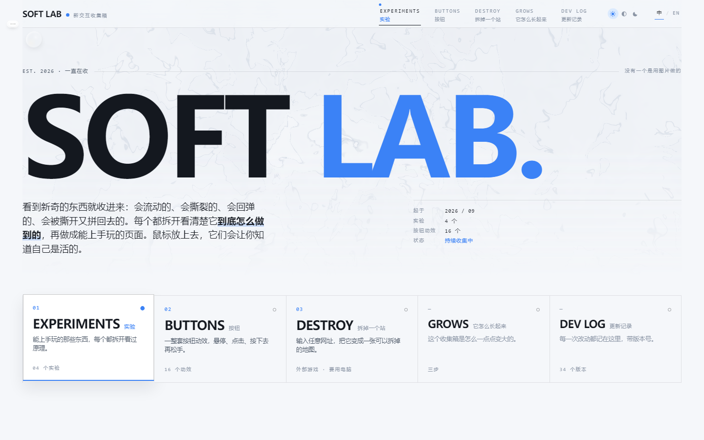
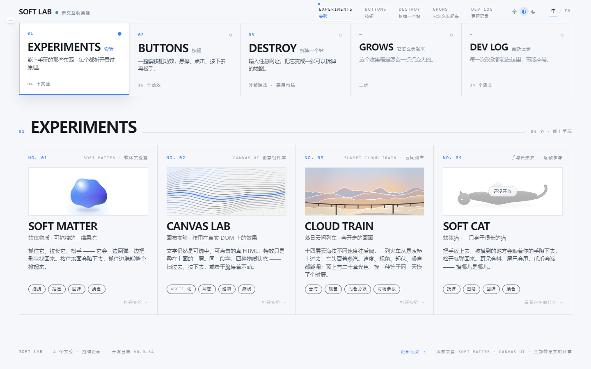
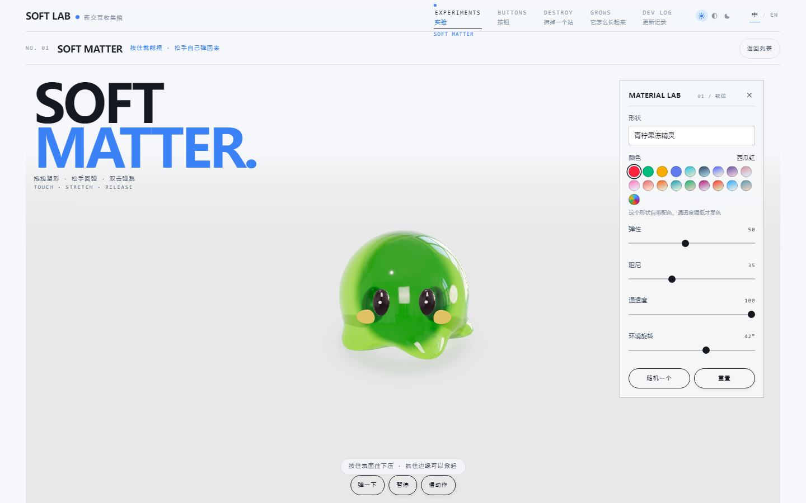
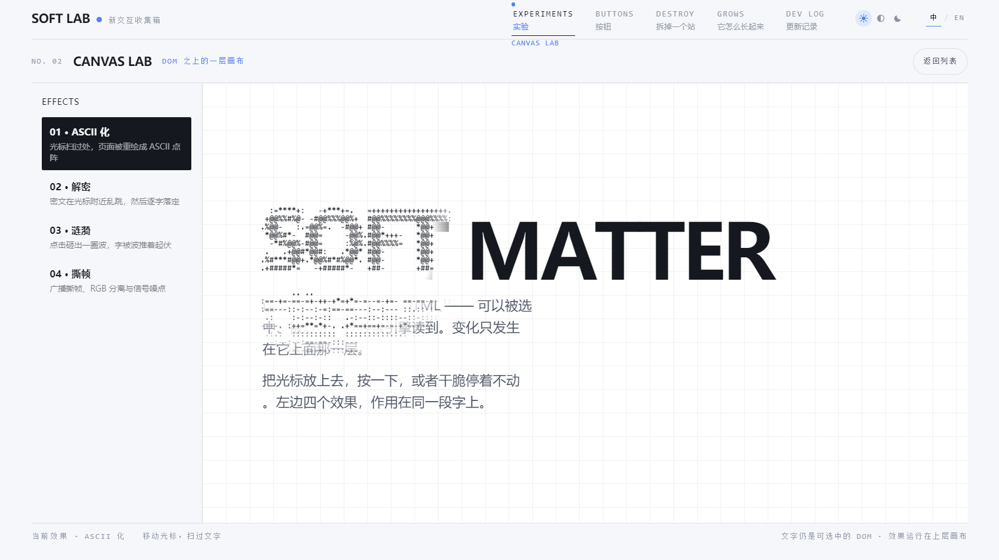
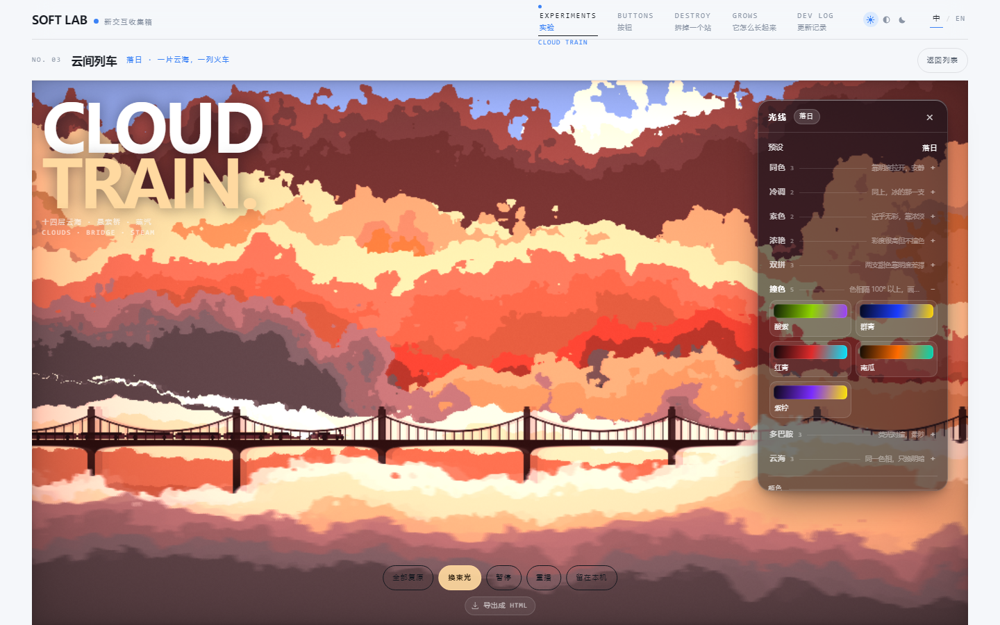
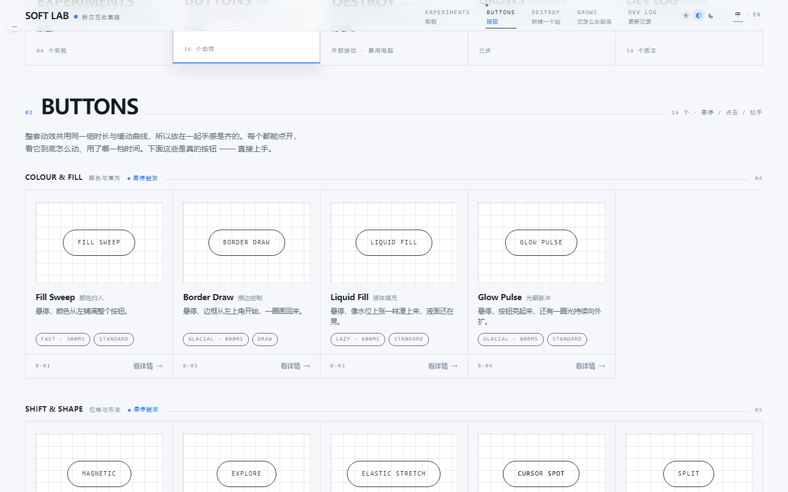
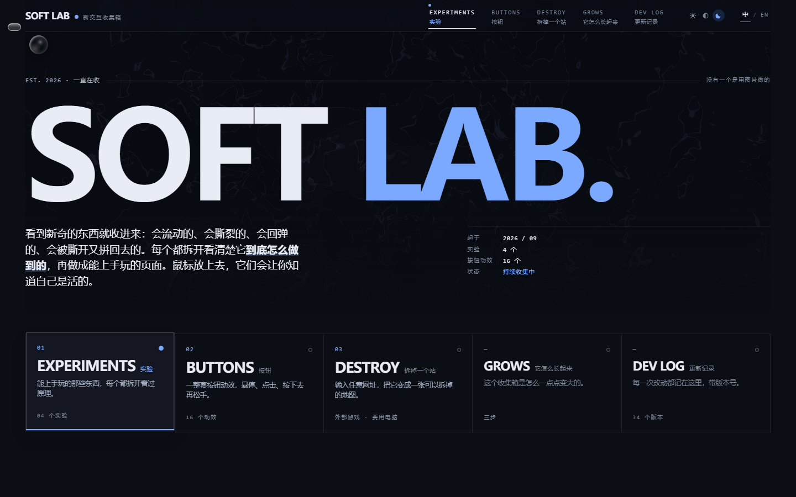

# SOFT LAB

**An index of digital matter**

*New things get collected the moment they turn up: ones that flow, ones that
tear, ones that spring back, ones that come apart and get put back together.
Each one is taken apart until we can see how it actually works, then rebuilt as
a page you can play with.*

[**Live site →**](https://doit.loc.cc/) · [中文说明](README.zh-CN.md)



---

## What this is

SOFT LAB is a personal collection of front-end visual interaction work. Its
purpose is to study visual effects and to share them — something to look at,
something to play with, and code that can be read. It is not a product, and
nothing here is intended to be released as one.

Three rules define it:

- **No images, and no AI-generated content, standing in for the motion.**
  Every effect on the page — the hero field, the jelly, the cloud sea, the
  sixteen button states — is rendered live in WebGL, canvas or CSS. Nothing is
  a pre-rendered still or a generated video pretending to be an effect.
- **Collected slowly, shown gradually.** Each experiment carries a
  `live` / `wip` status. Version 04 is marked `wip` in the source and displayed
  as such on the site, rather than quietly hidden.
- **These rules will keep evolving.**

The site is currently fully static. There is no plan and no content that would
call for a backend, a database, an external API or analytics.

## What's on the site

| # | Section | What it is |
|---|---|---|
| 01 | **Experiments** | A few hands-on pieces: a draggable soft-body lab, a typographic effect lab, the cloud-sea train — more being added |
| 02 | **Buttons** | Button micro-interactions in four groups (paint / motion / click / state) |
| 03 | **Destroy** | An entry point to an external game: [it turns any URL into a destructible map](https://destroy.spritefusion.com) |
| — | **Growth** | Collect → take apart → rebuild |
| — | **Dev log** | The full version history, newest first |



> Three projects so far; the last two carry no catalogue number. `growth` and
> `log` are columns about the site itself, not works in it, so they take no
> number. That rule lives in `src/lib/sections.ts`.

## The experiments

### 01 · Soft Matter — `live`

A jelly you can grab, stretch and let go of. Press the surface and it dents;
take hold of an edge and the whole thing lifts. Six shapes, a draggable colour
wheel, real HDRI refraction.



### 02 · Canvas Lab — `live`

Four effects applied to real, selectable HTML rather than to a picture of it:
the text is rasterised into a luminance grid and redrawn as ASCII, as a
decryption scramble, as a ripple, or as torn frames. The paragraph underneath
stays clickable the whole time.



### 03 · Cloud Train — `live`

Fourteen layers of cloud drifting past at their own parallax speeds while a
train crosses a suspension bridge. Speed, framing, swell and noise are all
adjustable, and there are twenty graded palettes — switching one is like
watching the same day happen at a different hour.



The newest palette family is *sea*: three sets that circle **one hue** and
separate the layers by brightness alone, from 0.25 to 1.0.

### 04 · Soft Cat — `wip`

An idea so far. It appears in the source and in this repository, but its real
state is still waiting on a future update.

## The button wall

Sixteen micro-interactions in four groups, all sharing one vocabulary of
durations and easing curves — so side by side they feel like one set rather than
sixteen. Every card is a real button: hover it, click it, hold it and let go.



## Dark mode

The site ships a full dark token set, applied through the same CSS custom
properties as the light one. The canvas layers do not follow CSS, so they are
handed the scheme explicitly — see `src/lib/theme.ts`.



## Running it locally

Requires **Node 20.19+ or 22.12+** (Vite 8).

```bash
npm install
npm run dev        # dev server
npm run build      # tsc --noEmit && vite build  →  dist/
npm run preview    # serve the built output on :4173
```

`dist/` is a plain static folder. Routing is a hand-written hash router, so
there is **no SPA fallback rule to configure** — drop it on any static host.

### Responsive layout — phones, tablets and non-standard viewports

The breakpoint axis is `orientation` + `height`, **not** `width`. A phone held
in landscape is 926px wide — wider than the 720px guard that was supposed to
catch small screens — so it silently inherits the desktop layout and the
interaction panel covers the whole picture. Height is the axis that actually
separates the cases. Heights are in `svh` (stable) while positioning uses `dvh`,
because `vh` is always too tall on iOS and `dvh` re-lays-out as the address bar
hides. On a phone the interaction panel becomes a bottom drawer — the top 38% of
the screen always stays picture — and returns to a right-hand column in
landscape.

## Project layout

```
src/
├── home/          the tab deck and its five panels
├── shell/         site header, footer, hero field, hero orb
├── experiments/   one folder per experiment + registry.ts
├── buttons/       button registry, one entry per effect
├── motion/        the shared duration + easing tokens
├── lib/           hash router, i18n, theme, changelog, webgl helpers
└── styles/        the CSS, in components
```

Three points worth knowing before you read the code:

- **Duration is a token, never a number.** Every effect names a step
  (`fast` / `base` / `slow` / `lazy` / `tide` / `glacial`) and the label in the
  UI is *derived* from it, so the two can never drift apart.
- **The registry is data, not markup.** Experiments and buttons describe
  themselves; the catalogue numbering comes from `findExperiment(slug)?.no`
  rather than being typed into a page header.
- **The changelog is the source of truth for history.** `src/lib/changelog.ts`
  holds one entry per version, and the dev-log page is rendered from it.

## Version history

The dev log lives on the site at `#/log` and in **[CHANGELOG.md](CHANGELOG.md)** —
34 entries, one per version, each recording what changed and *why*. Both read
from [`src/lib/changelog.ts`](src/lib/changelog.ts), which is the single source of
truth: that file is the real history of this project, and this repository is its
current state.

## Sources and licensing

**MIT** — see [LICENSE](LICENSE).

This project draws on a number of other projects, so every part that comes from
elsewhere is recorded together with its original licence in
**[THIRD_PARTY.md](THIRD_PARTY.md)**.

## Credits

- **[Luffyzhang2016/soft-matter](https://github.com/Luffyzhang2016/soft-matter)** — the soft body.
- **[DavidHDev/canvas-ui](https://github.com/DavidHDev/canvas-ui)** — the canvas effects.
- **mdb** — the original *"Up in the CloudSea"* shader, via
  [Rice-dog/code-codex](https://github.com/Rice-dog/code-codex) and
  [incarnation-gem/sunset-cloud-train](https://github.com/incarnation-gem/sunset-cloud-train).
- **[Hugo Duprez / Sprite Fusion](https://www.spritefusion.com)** — the destroy-the-web game.
- **[Poly Haven](https://polyhaven.com/a/pav_studio_03)** — the CC0 studio HDRI used by the Soft Matter experiment.

---

*Est. 2026 · still collecting*
